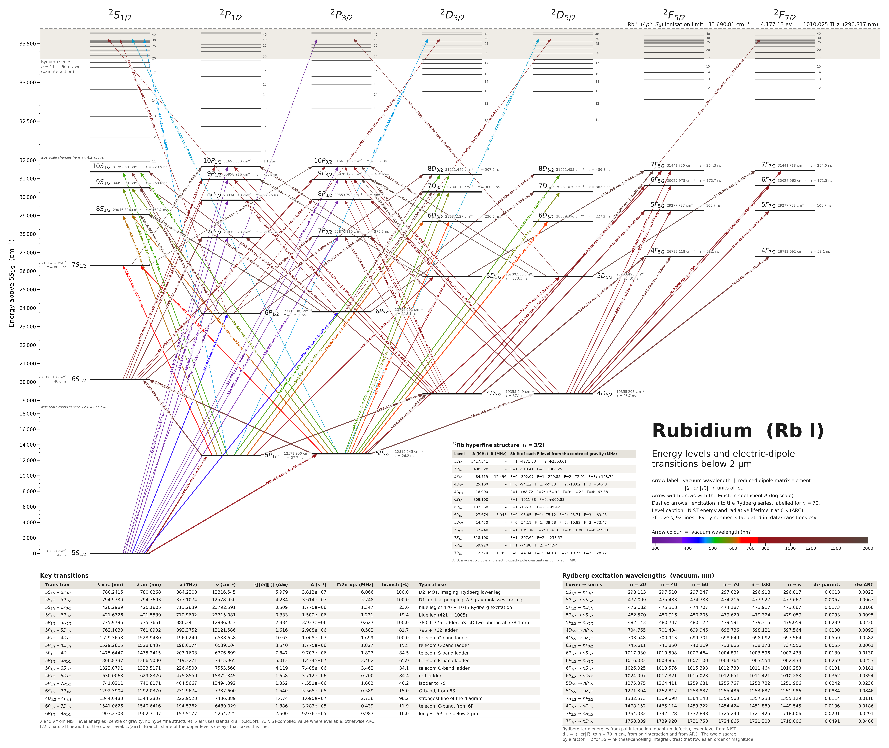

# Rb I energy levels and E1 transitions below 2 µm

**Interactive version: https://muuuun.github.io/rb-energy-levels/** — hover a line or a level to isolate it, click to pin, scroll to zoom.

`figures/rb_energy_levels.pdf` (vector, 38 × 32 in) and `.png` — Grotrian diagram of the 36 fine-structure
levels up to 10S / 10P / 8D / 7F, all 92 electric-dipole lines with vacuum wavelength < 2 µm, and the
excitation paths into the Rydberg series. Each arrow carries its vacuum wavelength and reduced dipole
matrix element |⟨J‖er‖J′⟩| in e·a0.

    python3 compute_rb_levels.py   # NIST + ARC + pairinteraction -> data/*.csv, data/validation.txt
    python3 plot_rb_levels.py      # data/*.csv -> figures/ and docs/ (SVG + data.json for the web page)

## Which source supplies what

| Quantity | Source |
|---|---|
| Level energies, wavelengths, frequencies (n ≤ 10) | NIST ASD level energies (Ritz wavelengths) |
| Rydberg term energies (n ≥ 11) | pairinteraction 2.3.1 |
| Dipole matrix elements, lifetimes, branching ratios | ARC 3.9.0 (literature values where it has them, model potential otherwise) |
| Einstein A, where NIST lists one (D lines, 5S–nP, 5P–6D) | NIST ASD; the matrix element is then derived from it |
| 87Rb hyperfine constants | ARC |

## Data files

- `data/transitions.csv` — per line: vacuum / air wavelength, frequency, wavenumber, ARC and pairinteraction
  wavelength, NIST observed wavelength and A, matrix element (`rme_J_best_ea0` is the one on the figure), branching ratio.
- `data/levels.csv` — energy from all three sources, binding energy, effective quantum number, lifetime at 0 K and 300 K.
- `data/rydberg_series.csv`, `data/rydberg_levels.csv` — wavelengths to n = 20…100 and Rydberg term energies.
- `data/hyperfine_87Rb.csv`, `data/validation.txt`, cached NIST tables `nist_rb1_*.tsv`.

## What the cross-check found (`data/validation.txt`)

- pairinteraction reproduces NIST level energies to 0.001 cm⁻¹ for n ≤ 12.
- ARC is off by up to 0.55 cm⁻¹ (16 GHz) for 8S, 8P, 8D, and by about −0.15 cm⁻¹ on Rydberg levels;
  ARC wavelengths are therefore kept only as a comparison column.
- ARC's model-potential rates for 5S → 9P, 10P are about 3× the NIST values; the figure uses NIST there.
- For 5S → nP Rydberg excitation (297 nm) ARC and pairinteraction matrix elements differ by about 2×.
