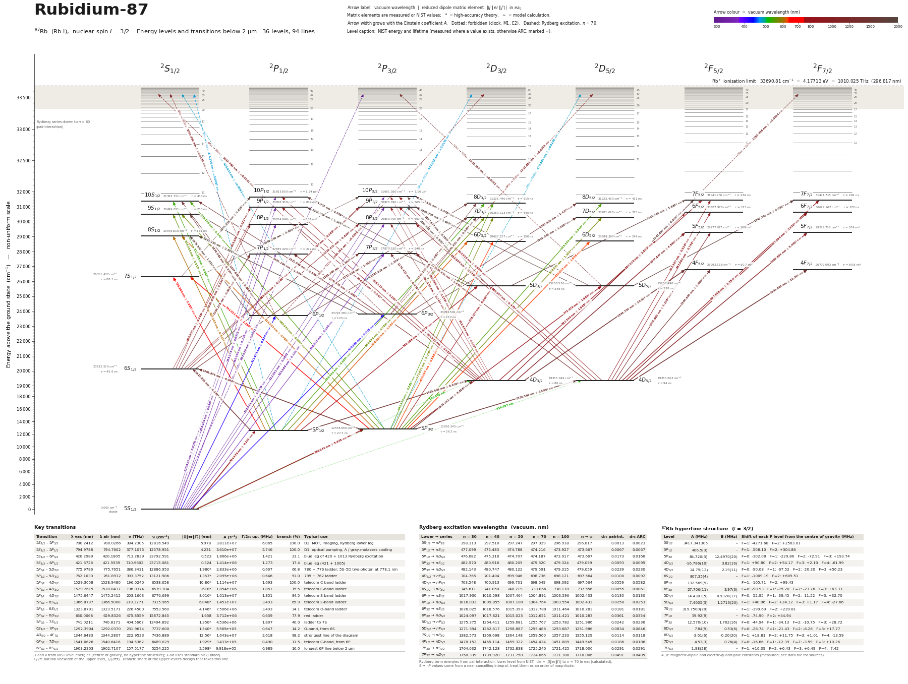

# Atomic energy level diagrams

**Interactive site: https://muuuun.github.io/atom-energy-levels/**

Large-format Grotrian diagrams of the neutral atoms used in cold-atom, tweezer, clock and ion-trap labs
(Li, Be, Na, Mg, K, Ca, Rb, Sr, Cs, Ba, Yb, Dy; several isotopes each). Every transition below 2 µm is drawn and
labelled with its vacuum wavelength and reduced dipole matrix element |⟨J‖er‖J′⟩| (e·a0). On the site, hover a line
or a level to isolate it, click to pin, filter by transition type (E1, intercombination, M1, E2, M2, Rydberg).

## Pipeline

    python3 compute.py all     # NIST ASD + data/literature/*.json (+ ARC, pairinteraction for alkalis) -> data/<key>/atom.json, *.csv
    python3 plot.py all        # -> docs/<slug>/diagram.svg|pdf, preview.png, data.json
    python3 build_site.py      # -> docs/**/index.html, sitemap.xml
    python3 stats.py           # -> data/provenance.md  (which source supplied how many numbers)

`species.py` lists the species. Adding one is a dictionary entry: `kind="nist"` needs only the element symbol, an energy
cut and the isotope; `kind="alkali"` additionally uses ARC so that every E1-allowed pair gets a matrix element.

## Where the numbers come from

Priority for every number: measurement (`data/literature/<El>.json`, each value with citation and URL) > NIST ASD >
high-accuracy theory quoted in the literature > ARC model potential (alkalis only). Each value carries its tier in the
CSV files and on the site (`measured`, `NIST`, `theory`, `model calc.`); on the diagrams `*` marks theory and `≈` a model value.

| Quantity | Source |
|---|---|
| Level energies, wavelengths, frequencies | NIST ASD level energies; measured isotope-specific frequencies where available |
| Transition rates, matrix elements | measured > NIST ASD > all-order theory (UDel portal, Safronova et al.) > ARC |
| Lifetimes | measured > theory > ARC sum of rates (alkalis) |
| Hyperfine constants, isotope shifts | measurements (Allegrini et al. 2022 survey, Steck, original papers) |
| Rydberg term energies | pairinteraction (Rb); ARC quantum defects hung from the NIST ionisation limit (other alkalis) |

Current counts are in [`data/provenance.md`](data/provenance.md); per-species cross-checks in `data/<key>/validation.txt`.

Known caveats: NIST level energies refer to the natural isotope mixture, so wavelengths of minority isotopes are off by the
isotope shift (listed where measured); conflicts between sources are recorded in the `notes` / `conflicts` fields of the
literature files; some old lifetime measurements (Cs n ≥ 8) are probably less accurate than modern theory but are kept as primary.
